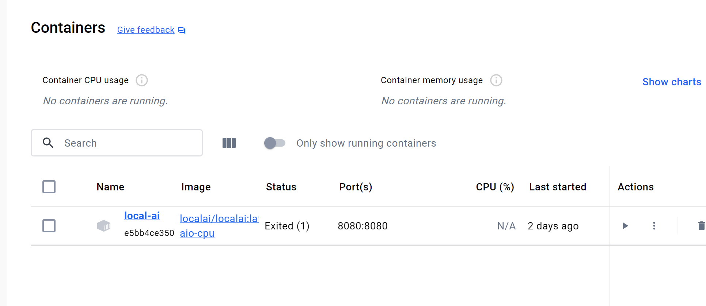
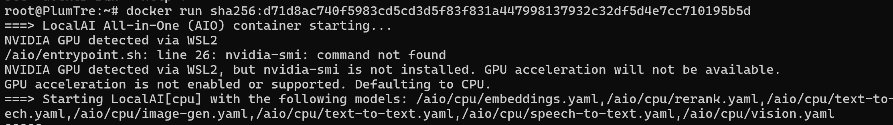
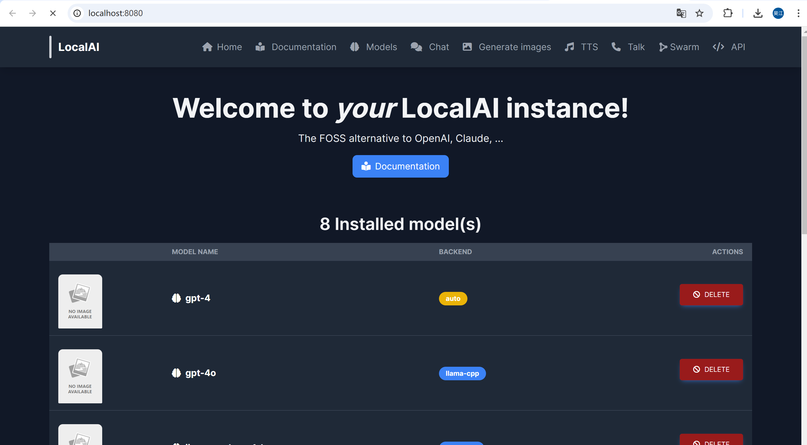
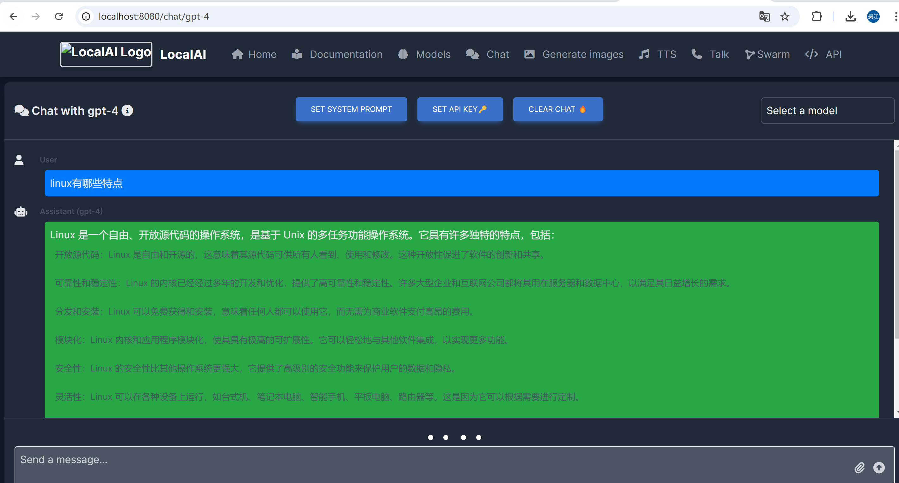
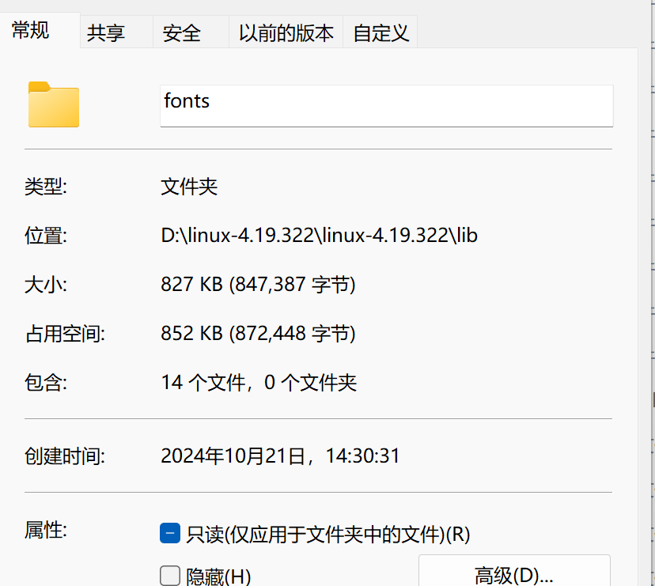
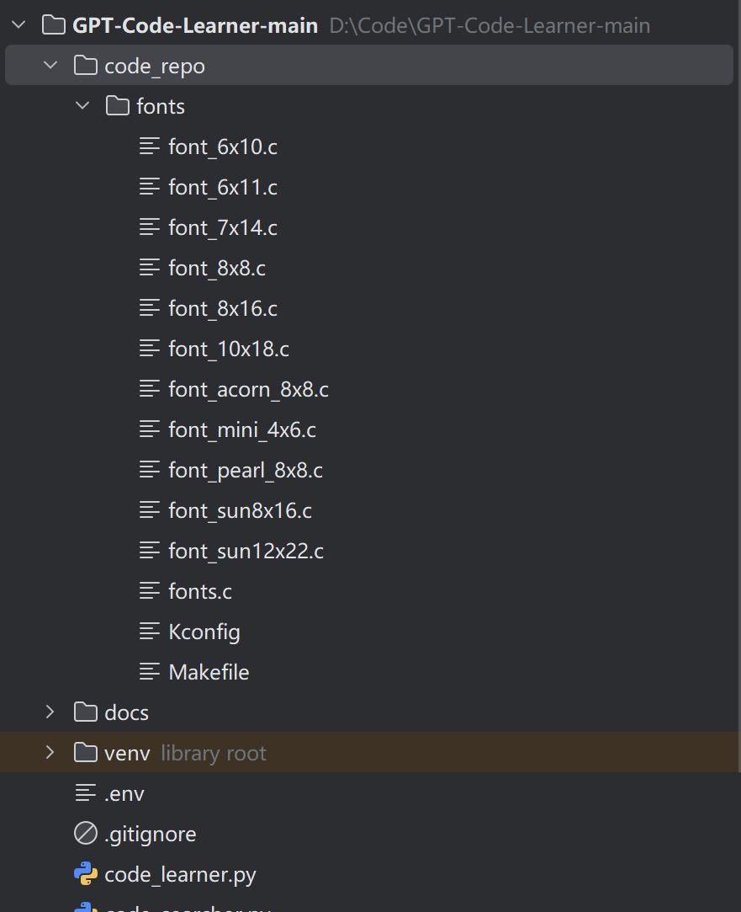
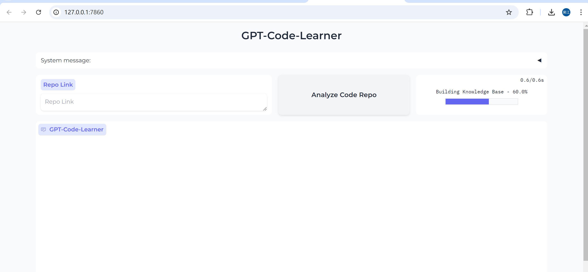
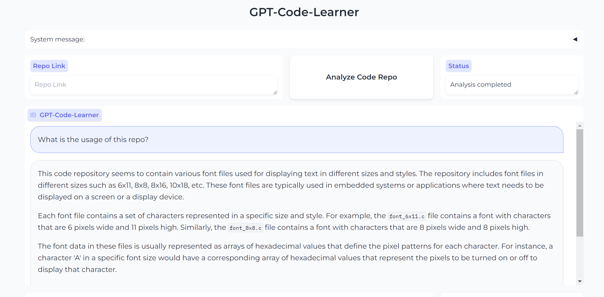

# 实验七 类shell-gpt智能助手
221310115_刘昊江 22xxxx_ggg 22xxxx_cmx

## 项目简介 
### 功能介绍
gpt-code-learner的简介

localAI(模型为ggml-gpt4all-j)的介绍

### 使用前景
用来学习linux源码之类的

### 创新点
完全运行在linux

本地大模型（支持模型切换）

## 实现原理
### gpt-code-learner
（代码向量化之类的东西）

### localAI
docker配置，实现原理，cpu运行方法

## 项目演示
### 启动localAI
在wsl2中运行docker，可以看到我们已经成功的部署localAI

在8080端口运行localAI,打开本地端口

这里我们部署了不同的大模型以供使用，考虑到本机的性能，我将使用llma_lite作为实际运行时的模型

测试模型能否正常运行

### 使用code_learner分析linux源码
以linux/lib/fonts为例

将fonts文件夹粘贴到code_learn下的code_repo中

运行文件分析

大模型学习项目后，可以开始提问

